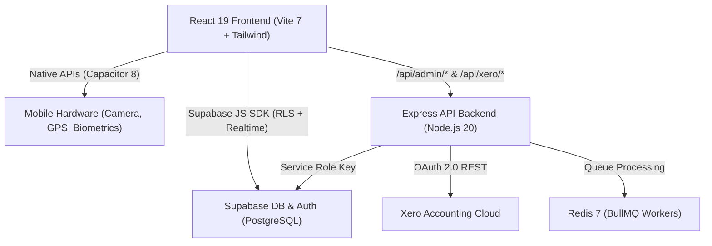

# AmpedFieldOps V2 ⚡

> Next-Generation Field Operations, Electrical Compliance, Job Management & Fleet Platform built for electrical contractors, trade professionals, and service enterprises. Powered by React 19, TypeScript, Tailwind CSS, Node.js, Express, BullMQ, Redis, and Supabase.

---

## 🎯 Platform Capabilities

### ⚡ Electrical Compliance & Switchboards (AS/NZS 3000)
- **Official Statutory Certificates**: Issue statutory Certificates of Compliance (CoC) and Electrical Safety Certificates (ESC) with high-risk work declarations and licensed electrical inspector endorsements.
- **Verification Test Sheets**: AS/NZS 3000 verification tests including earth continuity, insulation resistance (500V DC), polarity check, earth fault loop impedance, and RCD trip time/current testing.
- **Switchboard Circuit Directories**: Interactive switchboard schedule builder with pole layout, circuit breaker types (MCB, RCBO, RCD), cable sizing, phase balancing (A/B/C), and automated load calculations.
- **Test Meter Calibration Register**: Manage test instruments (testers, clamp meters, insulation testers) with calibration expiry alerts and audit logs.

### 🛡️ Site Safety & Hazard Assessment (SSSP / SWMS)
- **Digital SWMS & Job Safety Analysis**: Create and deploy Safe Work Method Statements with 5×5 risk assessment matrices (inherent vs. residual risk) and mandatory PPE requirements.
- **Daily Pre-Start Briefings & Sign-Off**: Digital site safety induction with electronic canvas signatures stored directly with timestamps and location tags.
- **Attendance Kiosk & Evacuation Roll-Call**: Real-time QR code site check-in/out with live roll-call lists for emergency site evacuation.
- **Fleet Vehicle Pre-Starts**: Daily pre-trip check sheets with defect reporting and escalation workflows.

### 👥 User Lifecycle & Enterprise RBAC
- **Soft Deactivation vs. Permanent Deletion**:
  - **Deactivate**: Instantly revokes session tokens and blocks login while completely preserving all historical timesheets, compliance certificates, and safety sign-offs.
  - **Permanent Delete**: Administrative cascade deletion that safely sanitizes relational constraints, unlinks historical audit records, and purges credentials from Supabase Auth and database tables.
- **Granular Permission Matrix (35+ Keys)**: Fine-grained controls across 11 functional modules (Projects, Financials, Invoices, Master Inventory, Compliance, Switchboards, Safety, Timesheets, Scheduling, Fleet, and Administration).
- **Preset & Custom Roles**: Out-of-the-box presets for **Administrator**, **Project Manager**, **Field Technician**, **Apprentice**, and **Office Administrator**, with interactive custom role builder.
- **Secure Token-Based Invitations**: Dedicated onboarding flow allowing invitees to set passwords and activate accounts via cryptographically secure links.

### 🔍 Spotlight Omnisearch
- **Universal Operational Search**: Instant keyboard-driven search (`Ctrl+K` / `Cmd+K`) across Projects, Purchase Orders, Clients, Master Inventory Items, Storage Depots/Vans, Team Members, Safety SWMS, Switchboard Schedules, Invoices, and QC Snags.
- **Category Filter Tabs**: Quick filtering by module with real-time result counters and keyboard arrow navigation (`↑`/`↓`/`↵`/`Esc`).

### 📦 Multi-Depot Inventory & Van Stock
- **Master Catalog & Stock Locations**: Central warehouse catalog with support for unlimited satellite storage depots, service vans, and job site containers.
- **Inter-Location Transfers**: Transfer stock between warehouses and technician vehicles with audit trails.
- **OCR Material Receipt Scanner**: On-device and server-assisted OCR engine for capturing supplier packing slips and purchase receipts directly into job material logs.

### 📅 Field Timesheets & Resource Scheduling
- **Visual Day Timeline**: Interactive technician hour grid with drag-to-resize duration, automatic travel time calculations, and lunch break deductions.
- **Bulk Weekly Approvals**: High-speed batch submission, supervisor sign-off, and one-click unapproval flows.
- **GPS Travel Billing Engine**: Automatic geolocation logging with road-factor adjusted Haversine distance calculations for mileage reimbursement.

### 🔄 Xero Cloud Accounting Sync
- **Bi-Directional Synchronization**: Automatic background synchronization for Contacts, Inventory Items, and Sales Invoices.
- **Resilient Background Queues**: Powered by BullMQ and Redis with automatic retries, concurrency limits, and comprehensive sync audit logs.

---

## 🏗️ Architecture & Tech Stack



### Frontend
- **Framework:** React 19 + TypeScript + Vite 7
- **Styling:** Tailwind CSS 3.4 + Material Symbols + Custom dark-mode tokens
- **Mobile Engine:** Capacitor 8 (Camera, Geolocation, Filesystem, Push Notifications, Status Bar)
- **OCR:** Tesseract.js client-side fallback + server-assisted vision processing
- **PDF Generation:** jsPDF + html2canvas for statutory compliance certificates and switchboard schedules
- **State & Hooks:** Context API + custom hooks (`useProjects`, `useCompliance`, `useSafety`, `useInventoryLocations`, `useGlobalSearch`, `usePermissions`, etc.)

### Backend & Infrastructure
- **Server:** Node.js 20+ Express.js in TypeScript
- **Job Queues:** BullMQ with Redis 7
- **Database:** Supabase PostgreSQL with 25+ SQL migrations, custom RPC functions (`admin_toggle_user_active`, `admin_delete_user`), and strict Row Level Security (RLS)
- **Encryption:** AES-256-CBC with SHA-256 derived keys for sensitive OAuth tokens
- **Deployment:** Docker & Docker Compose on Proxmox LXC VPS (`192.168.1.201`) reverse-proxied via Nginx

---

## 📱 Native Mobile Setup (Capacitor 8)

AmpedFieldOps is fully configured for native mobile compilation via Capacitor:

```bash
# 1. Build production web bundle
npm run build

# 2. Sync web assets with native mobile projects
npx cap sync

# 3. Launch native IDEs for compilation
npx cap open android   # Android Studio -> Generate Release APK / AAB
npx cap open ios       # Xcode (macOS) -> Archive & TestFlight
```

---

## 🚀 Local Development Setup

### Prerequisites
- Node.js 20+
- Redis (optional for local queue processing; required for Xero sync)
- Supabase project credentials

### Step-by-Step Installation

```bash
# 1. Clone repository
git clone https://github.com/tripplej33/AmpedFieldOps-v2.git
cd AmpedFieldOps-v2

│   │   ├── safety/          # SiteAttendanceKiosk, EvacuationModal
│   │   ├── procurement/     # PurchaseOrderModal, GoodsReceipt
│   │   ├── settings/        # RoleModal, UserInviteModal, ProfileSettings
│   │   ├── search/          # GlobalSearchModal
│   │   ├── layout/          # Sidebar, Header, NotificationDropdown, Layout
│   │   └── ui/              # Button, Input, Modal, ConfirmDialog, Toast, Spinner, Badge
│   ├── contexts/
│   │   └── AuthContext.tsx  # Authentication & cached profile hydration
│   ├── hooks/               # Domain hooks (useFiles, useGeolocation, usePermissions, etc.)
│   ├── lib/                 # Supabase client, OCR service, crypto, validators
│   ├── pages/               # Main application pages
│   └── types/               # TypeScript interfaces & permission definitions
├── backend/                 # Node/Express API & Xero sync workers
├── supabase/
│   └── migrations/          # Version-controlled PostgreSQL migrations & RLS policies
├── Dockerfile.frontend      # Multi-stage production Nginx container
├── docker-compose.yml       # Production stack orchestration
├── nginx.conf               # Nginx reverse proxy configuration
└── package.json
```

---

## 🔐 Roles & Permission Matrix

| Role | Timesheets | Projects & Cost Centers | Purchase Orders & Materials | Snags & Safety | File Explorer |
| :--- | :---: | :---: | :---: | :---: | :---: |
| **Administrator** | Full / Delete | Full / Assign | Full / Approve | Full | View, Upload, Rename, Delete |
| **Project Manager** | View All / Approve | Create & Edit | Create & Approve | Full | View, Upload, Rename |
| **Field Technician**| Log & Submit Own | View Assigned | Log Van Materials | Manage Snags & Sign-in | View & Upload Photos |
| **Apprentice** | Log & Submit Own | View Assigned | View Materials | Site Sign-in | View |
| **Office Admin** | View All / Payroll | View All | POs & Financials | View Reports | View & Upload |
| **Subcontractor** | - | Assigned Snags | - | Site Sign-in | View Documents |

---

## 🛠️ Build & Verification

```bash
# Type check and build bundle
npm run build

# Preview build locally
npm run preview
```

---

## 📄 License
Private repository. All rights reserved by Amped Field Operations.
