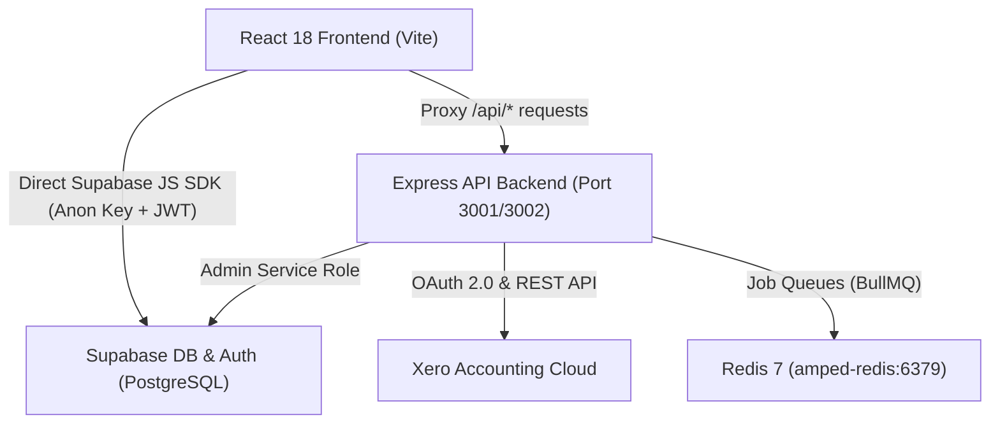

# AmpedFieldOps V2 - API & Architecture Reference

This document provides a comprehensive specification of the AmpedFieldOps V2 backend API, authentication flow, background worker queues, and database schema.

---

## 🏗️ Architecture Overview



- **Frontend:** React 18, Vite 7, Tailwind CSS, Space Grotesk font, Material Symbols.
- **Backend:** Node.js 20+, Express.js, BullMQ, ioredis, @supabase/supabase-js, xero-node.
- **Data Layer:** Supabase PostgreSQL with 24 RLS migration scripts, storage buckets, and auth schemas.
- **Deployment:** Docker Compose (`amped-frontend`, `amped-backend`, `amped-redis`) reverse proxied via Nginx Proxy Manager with SSL at `https://admin.ampedlogix.com`.

---

## 🔐 Authentication & Security

- **Client Authenticated Requests:**
  Frontend components query Supabase directly using user session JWT tokens. Row Level Security (RLS) automatically filters data according to user role (`admin`, `manager`, `technician`, `viewer`).
- **Backend Admin Operations:**
  Express endpoints communicate with Supabase using `SUPABASE_SERVICE_ROLE_KEY` for background jobs, Xero synchronization, and system configuration.
- **Credentials Encryption:**
  Sensitive OAuth tokens and client secrets are encrypted in the database using AES-256-CBC with SHA-256 derived keys (`backend/src/lib/crypto.ts`).

---

## 📡 Backend API Endpoints

### 1. Health & System
| Method | Endpoint | Description | Response |
|---|---|---|---|
| `GET` | `/health` | Server and Redis health check | `{ status: "ok", timestamp: string, redis: string }` |

### 2. Admin & Settings (`/api/admin`)
| Method | Endpoint | Description | Body / Query |
|---|---|---|---|
| `GET` | `/admin/dashboard/stats` | Aggregated project statistics & revenue metrics | None |
| `GET` | `/admin/settings/xero` | Get current Xero configuration status | None |
| `POST` | `/admin/settings/xero` | Save Xero client ID, client secret, and redirect URI | `{ clientId, clientSecret, redirectUri, scopes? }` |
| `POST` | `/admin/settings/xero/disconnect` | Revoke tokens and disconnect Xero tenant | None |

### 3. Xero Integration (`/api/xero`)
| Method | Endpoint | Description | Parameters |
|---|---|---|---|
| `GET` | `/xero/auth` | Initiate Xero OAuth 2.0 consent flow | Redirects to Xero login |
| `GET` | `/xero/callback` | OAuth 2.0 redirect callback handler | `?code=...&state=...` |
| `GET` | `/xero/status` | Real-time connection & tenant status | None |
| `POST` | `/xero/sync/contacts` | Trigger bi-directional contacts sync | `{ direction?: "push" \| "pull" \| "both" }` |
| `POST` | `/xero/sync/invoices` | Trigger invoice import/export job | None |
| `POST` | `/xero/sync/items` | Sync products/services to Activity Types | None |
| `POST` | `/xero/sync/all` | Master sequential sync queue job | None |

---

## ⚙️ Environment Variables Reference

### Root Frontend (`.env`)
```ini
VITE_SUPABASE_URL=https://dcssbsxjtfibwfxoagxl.supabase.co
VITE_SUPABASE_ANON_KEY=eyJhbGciOiJIUzI1Ni...
VITE_BACKEND_URL=/api
VITE_ENV=production
```

### Backend (`backend/.env`)
```ini
PORT=3001
NODE_ENV=production
FRONTEND_URL=https://admin.ampedlogix.com
SUPABASE_URL=https://dcssbsxjtfibwfxoagxl.supabase.co
SUPABASE_SERVICE_ROLE_KEY=eyJhbGciOiJIUzI1Ni...
REDIS_URL=redis://localhost:6379
ENCRYPTION_KEY=vps_amped_fieldops_encryption_key_32bytes!
```

---

## 🗄️ Database Tables (Supabase Schema)

1. `users` - User profiles linked to `auth.users` with roles (`admin`, `manager`, `technician`, `viewer`).
2. `clients` - Customer accounts with billing details and `xero_contact_id`.
3. `projects` - Job / project tracking with statuses, start/end dates, and budgets.
4. `cost_centers` - Project budget buckets, `customer_po_number`, and allocation tracking.
5. `timesheets` - Labor logs linked to projects and technicians (Draft → Submitted → Approved → Invoiced).
6. `timesheet_entries` - Granular line items with activity types, hours, and rates.
7. `activity_types` - Work categories mapped to Xero items with billing rates.
8. `xero_tokens` - Encrypted OAuth access & refresh tokens.
9. `xero_invoices` - Invoices mirrored between Xero and AmpedFieldOps.
10. `xero_sync_log` - Historical audit trail of synchronization jobs and error diagnostics.
11. `app_settings` - Encrypted system settings and integration configurations.
12. `project_files` - Storage metadata linked to Supabase Storage objects.
