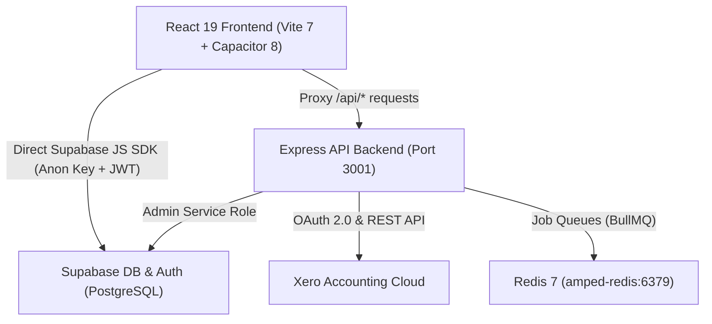

# AmpedFieldOps V2 - API & Architecture Reference

This document provides a comprehensive specification of the AmpedFieldOps V2 backend API, authentication flow, background worker queues, database stored procedures (RPCs), and schema definitions.

---

## 🏗️ Architecture Overview

- **Frontend:** React 19, Vite 7, Tailwind CSS 3.4, Capacitor 8, Material Symbols.
- **Backend:** Node.js 20+, Express.js, BullMQ, ioredis, @supabase/supabase-js, xero-node.
- **Data Layer:** Supabase PostgreSQL with 25+ RLS migration scripts, storage buckets, and auth schemas.
- **Deployment:** Docker Compose (`amped-frontend`, `amped-backend`, `amped-redis`) reverse proxied via Nginx on Proxmox LXC (`192.168.1.201`).

---

## 🔐 Authentication & Security

- **Client Authenticated Requests:**
  Frontend components query Supabase directly using user session JWT tokens. Row Level Security (RLS) automatically filters data according to user role (`admin`, `manager`, `technician`, `apprentice`, `office`).
- **Backend Admin Operations:**
  Express endpoints communicate with Supabase using `SUPABASE_SERVICE_ROLE_KEY` for background jobs, user lifecycle actions, Xero synchronization, and system configuration.
- **Session Revocation:**
  When a user is disabled, their session is invalidated globally (`supabase.auth.admin.signOut(id, 'global')`), and `auth.users.banned_until` is updated.
- **Credentials Encryption:**
  Sensitive OAuth tokens and client secrets are encrypted in the database using AES-256-CBC with SHA-256 derived keys (`backend/src/lib/crypto.ts`).

---

## 📡 REST API Endpoints

### 1. System Health
| Method | Endpoint | Description | Response |
|---|---|---|---|
| `GET` | `/health` | Server, uptime, timestamp, and Redis health check | `{ status: "ok", uptime: number, timestamp: string, redis: string }` |

### 2. User Lifecycle Management (`/api/admin`)
| Method | Endpoint | Description | Payload / Response |
|---|---|---|---|
| `POST` | `/admin/users/:id/disable` | Soft-deactivates user, bans auth login, revokes sessions, preserves all historical logs | Response: `{ success: true, user: object }` |
| `POST` | `/admin/users/:id/enable` | Reactivates user account and clears ban | Response: `{ success: true, user: object }` |
| `DELETE` | `/admin/users/:id` | Permanently deletes account, unlinks historical references, purges credentials and auth | Response: `{ success: true, deleted: object }` |
| `POST` | `/admin/accept-invite` | Validates invitation token, sets user password, and marks accepted | Body: `{ token: string, password: string }` |

### 3. CRM & Client Endpoints (`/api/admin`)
| Method | Endpoint | Description | Response |
|---|---|---|---|
| `GET` | `/admin/clients` | List all client records with Xero contact status | Response: `Client[]` |

### 4. Xero OAuth & Integration (`/api/xero` & `/api/admin/xero`)
| Method | Endpoint | Description | Parameters / Body |
|---|---|---|---|
| `GET` | `/xero/auth` | Initiate Xero OAuth 2.0 consent flow | Redirects to Xero login |
| `GET` | `/xero/callback` | OAuth 2.0 redirect callback handler | Query: `?code=...&state=...` |
| `GET` | `/admin/xero/status` | Real-time connection, token expiry & last sync log | None |
| `POST` | `/admin/xero/sync-clients` | Enqueue background push of clients to Xero | None |
| `POST` | `/admin/xero/sync-pull-clients` | Enqueue background pull of Xero contacts | None |
| `POST` | `/admin/xero/sync-items` | Enqueue product/item sync to activity types | None |
| `POST` | `/admin/xero/sync-pull-invoices` | Enqueue import of Xero invoices | None |
| `POST` | `/admin/xero/sync-all` | Enqueue master sequential sync queue job | None |

---

## ⚡ Database Stored Procedures (RPCs)

All functions run with `SECURITY DEFINER` and enforce administrative role authorization:

### 1. `public.admin_toggle_user_active(target_user_id uuid, activate boolean)`
- **Purpose**: Toggles `is_active` flag on `public.users`.
- **Side Effects**: Sets `disabled_at` and `disabled_by`. Modifies `auth.users.banned_until` to `2099-01-01` when disabling or `NULL` when reactivating.
- **Safety**: Cannot deactivate the last remaining active administrator.

### 2. `public.admin_delete_user(target_user_id uuid)`
- **Purpose**: Cascading administrative deletion of a user.
- **Side Effects**:
  - Deletes `user_credentials`, `notifications`, and `project_members`.
  - Nullifies or marks historical references in `timesheets`, `project_snags`, `job_schedules`, and `vehicles` so historical records and payroll logs remain intact without constraint violations.
  - Deletes user profile from `public.users` and `auth.users`.
- **Safety**: Cannot delete the last remaining system administrator.

### 3. `public.admin_create_invited_user(target_email text, target_name text, target_role text)`
- **Purpose**: Administrative user provisioning with secure invitation link generation.

---

## 🗄️ Database Schemas (Supabase PostgreSQL)

| Table | Primary Key | Description | Key Columns |
|---|---|---|---|
| `users` | `id` (uuid) | User profiles linked to `auth.users` | `email, full_name, role, phone, is_active, disabled_at` |
| `roles` | `id` (text) | RBAC role definitions with permissions | `name, description, permissions (jsonb), is_system` |
| `user_invitations` | `id` (uuid) | Secure user onboarding tokens | `email, full_name, role_id, token, status, expires_at` |
| `projects` | `id` (uuid) | Operational project tracking | `name, client_id, status, address, city, budget` |
| `cost_centers` | `id` (uuid) | Project budget buckets | `project_id, name, customer_po_number, budget_hours` |
| `timesheets` | `id` (uuid) | Field technician labor logs | `user_id, project_id, work_date, hours, status, is_invoiced` |
| `inventory_locations` | `id` (uuid) | Depots, warehouses, and vans | `name, location_type, vehicle_id, is_primary` |
| `inventory_items` | `id` (uuid) | Master parts and stock catalog | `sku, name, category, unit_cost, default_charge_rate` |
| `safety_documents` | `id` (uuid) | Digital SWMS & site assessments | `project_id, title, category, status, pdf_url` |
| `switchboard_schedules` | `id` (uuid) | AS/NZS 3000 circuit directories | `project_id, board_name, location, circuits (jsonb)` |
| `electrical_certificates`| `id` (uuid) | Statutory CoC & ESC records | `project_id, cert_type, inspector_name, issue_date` |
| `invoices` | `id` (uuid) | Client billing & progress claims | `invoice_number, client_id, status, total_amount` |
| `xero_tokens` | `id` (uuid) | Encrypted OAuth tokens | `tenant_id, tenant_name, access_token, refresh_token` |
| `project_files` | `id` (uuid) | Uploaded site drawings & documents | `project_id, name, path, mime_type, size_bytes` |

